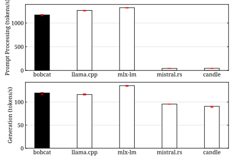
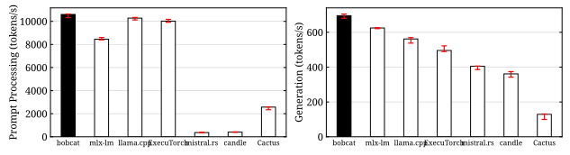
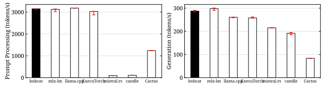
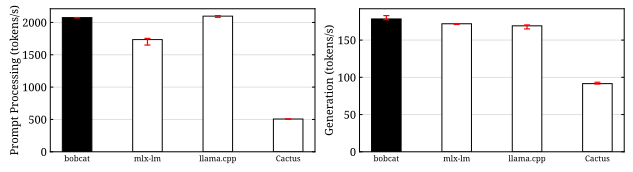
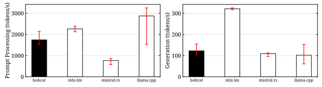
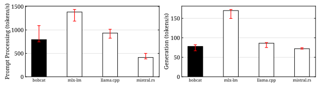
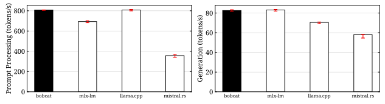
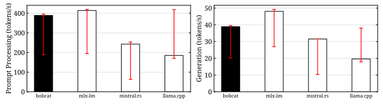

<p align="center">
  
</p>

<p align="center">
  <a href="https://github.com/jadidbourbaki/bobcat/actions/workflows/ci.yml"></a>
  
  <a href="rust-toolchain.toml"></a>
  <a href="LICENSE"></a>
  <a href="https://github.com/sponsors/jadidbourbaki"></a>
</p>

**bobcat** is an inference engine optimized for Apple silicon. Run
local models on your Mac at unbelievably fast speeds.

```console
bobcat chat -m lfm2.5:2.6b
> What is the capital of Japan? One sentence.
The capital of Japan is Tokyo.
```

## Quick start

Install bobcat on a Mac with Apple silicon and macOS 26 or newer:

```sh
curl -fsSL https://raw.githubusercontent.com/jadidbourbaki/bobcat/main/install.sh | sh
```

Download a model:

```sh
bobcat pull lfm2.5:2.6b
```

Chat with it:

```sh
bobcat chat -m lfm2.5:2.6b
```

Or answer one prompt, for scripts and pipes:

```sh
bobcat respond -m lfm2.5:2.6b "Name three primes."
```

## Performance results

<p align="center">
  
</p>

LFM2.5-2.6B on an M4 Pro, with a 512-token prompt and 128 generated
tokens. The details are [here](docs/performance/eval.md).

## bobcat ❤️ agents

Start the server, then point your agent at it:

```sh
bobcat serve -m lfm2.5:2.6b -c 65536
```

**[Claude Code](https://docs.claude.com/en/docs/claude-code/overview)**

```sh
ANTHROPIC_BASE_URL=http://127.0.0.1:8080 \
ANTHROPIC_AUTH_TOKEN=bobcat \
ANTHROPIC_API_KEY="" \
CLAUDE_CODE_MAX_CONTEXT_TOKENS=65536 \
claude --model lfm2.5:2.6b
```

**[opencode](https://opencode.ai)**, in `opencode.json`:

```json
{
  "$schema": "https://opencode.ai/config.json",
  "provider": {
    "bobcat": {
      "npm": "@ai-sdk/openai-compatible",
      "name": "bobcat",
      "options": { "baseURL": "http://127.0.0.1:8080/v1" },
      "models": { "lfm2.5:2.6b": { "name": "LFM2.5-2.6B" } }
    }
  }
}
```

**[aider](https://aider.chat)**

```sh
OPENAI_API_BASE=http://127.0.0.1:8080/v1 \
OPENAI_API_KEY=bobcat \
aider --model openai/lfm2.5:2.6b
```

## bobcat ❤️ decision models

Start the server, then ask it typed questions about any input:

```sh
bobcat serve -m qwen3.5:4b
```

**[SystemOne](https://modelsystem.one)**

```sh
curl http://127.0.0.1:8080/v1/systemone -d '{
  "model": "qwen3.5:4b",
  "state": "Checkout returns 500 errors and orders are blocked.",
  "questions": {
    "team": {"type": "choice", "criteria": {"billing": "Payments", "technical": "Bugs"}},
    "urgency": {"type": "score", "criteria": ["Can wait", "This week", "Today"]},
    "outage": {"type": "noul", "instructions": "Is a service down?"}
  }
}'
```

**[TypeSafe SDK](https://pypi.org/project/typesafe-sdk/)**

```python
from typesafe_sdk import Choice, TypeSafeClient

client = TypeSafeClient(base_url="http://127.0.0.1:8080", api_key="bobcat")
result = client.system_one(
    "Checkout returns 500 errors.",
    {"team": Choice(criteria={"billing": "Payments", "technical": "Bugs"})},
)
```

**[SGLang decisions](https://docs.sglang.io/docs/supported-models/decision_models)**

```sh
curl http://127.0.0.1:8080/v1/decisions -d '{
  "input": "Checkout returns 500 errors.",
  "questions": [{"id": "outage", "type": "yes_no", "question": "A service is down."}]
}'
```

`/v1/score` takes SGLang's prompt and label token ids for decisions you
build yourself.

**One decision without a server**

```sh
bobcat decide -m qwen3.5:4b '{"model": "qwen3.5:4b", "state": "Checkout is down.",
  "questions": {"outage": {"type": "noul", "instructions": "Is a service down?"}}}'
```

## Supported language models

<p align="center">
  
</p>

**[LFM2.5-350M](https://huggingface.co/LiquidAI/LFM2.5-350M-GGUF)**

```sh
bobcat pull lfm2.5:350m
```

<p align="center">
  
</p>

**[LFM2.5-1.2B-Instruct](https://huggingface.co/LiquidAI/LFM2.5-1.2B-Instruct-GGUF)**

```sh
bobcat pull lfm2.5:1.2b
```

<p align="center">
  
</p>

**[LFM2.5-2.6B](https://huggingface.co/LiquidAI/LFM2.5-2.6B-GGUF)**

```sh
bobcat pull lfm2.5:2.6b
```

<p align="center">
  
</p>

**[LFM2.5-8B-A1B](https://huggingface.co/LiquidAI/LFM2.5-8B-A1B-GGUF)**

```sh
bobcat pull lfm2.5:8b
```

<p align="center">
  
</p>

**[Qwen3.5-0.8B](https://huggingface.co/unsloth/Qwen3.5-0.8B-GGUF)**

```sh
bobcat pull qwen3.5:0.8b
```

<p align="center">
  
</p>

**[Qwen3.5-2B](https://huggingface.co/unsloth/Qwen3.5-2B-GGUF)**

```sh
bobcat pull qwen3.5:2b
```

<p align="center">
  
</p>

**[Qwen3.5-4B](https://huggingface.co/unsloth/Qwen3.5-4B-GGUF)**

```sh
bobcat pull qwen3.5:4b
```

<p align="center">
  
</p>

**[Qwen3.5-9B](https://huggingface.co/unsloth/Qwen3.5-9B-GGUF)**

```sh
bobcat pull qwen3.5:9b
```

## Supported decision models

Every language model above answers decisions, except LFM2.5-2.6B, whose
chat template always opens a reasoning block before the answer.

**[Clef-Flash](https://huggingface.co/Cloudflare/clef-flash)**

```sh
bobcat pull clef:flash
```

bobcat is still in alpha. We are rapidly adding support for more models
and model families. Please stay tuned!
